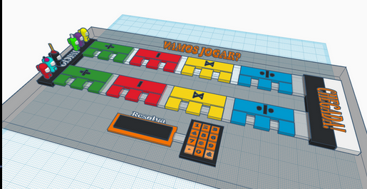

# Educative-Board-Game

*Protótipo de um jogo de tabuleiro feito com arduino UNO R3 em que se gera aleatoriamente contas de matemática básica (adição, subtração e divisão) em diferentes níveis para os usuários.*

  

* **DESCRIÇÃO**:

  ###### "Think Math Run" é um jogo para dois jogadores que competem entre si. O objetivo do jogo é resolver operações matemáticas simples de soma, subtração, multiplicação e divisão, nessa ordem específica. Existem dois caminhos possíveis para os jogadores chegarem ao final do jogo: um caminho curto e mais difícil, e um caminho mais longo e mais fácil.
  ###### Todos os jogadores começam pelo caminho mais difícil, que possui operações mais complexas. Nesse caso, só existe uma única questão. Se um jogador errar uma operação nesse caminho, será direcionado para o caminho mais fácil, com operações mais simples, mas terá que responder três questões. No entanto, a cada nova seção aritmética, mesmo que o jogador tenha terminado a seção anterior no caminho fácil, ele ainda pode tentar responder a próxima seção no caminho mais difícil. O vencedor é o jogador que chegar primeiro ao final do jogo.
  
  
* **COMO JOGAR**:
 
  ###### -O jogo começa com um jogador, que deve ser definido pelos próprios jogadores. O fato de iniciar não oferece vantagem para o jogador. O primeiro a jogar será referenciado pelo resto do jogo como "Jogador 1" e o segundo como "Jogador 2";
  
  ###### -No display aparecerá a primeira operação para ser resolvida pelo "Jogador 1". Como definiu-se pela lógica do jogo, o display mostrará uma conta do primeiro estágio, ou seja, de soma, no nível difícil.
  
  ###### -Apenas o participante que está na vez pode responder. No protótipo, tem-se um teclado em que o jogador deve digitar sua resposta no formato de número inteiro. Após ter a resposta final, deve apertar o botão asterisco (*) para enviar a resposta. O jogo conferirá se a conta está correta e mostrará no display.
  
  ###### -O jogo segue iterativamente. Independentemente de o "Jogador 1" acertar ou não, a próxima vez será do "Jogador 2". Tudo isso será indicado no display e deve ser seguido.
  

